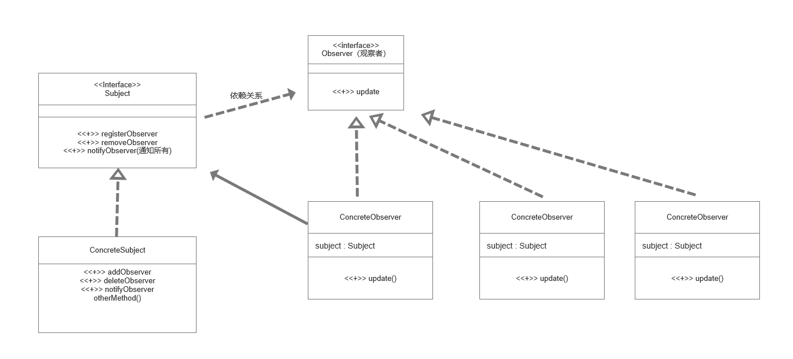

### 观察者模式  Observer (目的 使开发更有规律清晰，条理，有更好的扩展性)
* 观察者模式定义
  * 在对象之间定义了一对多的依赖，这样一来，当一个对象改变状态，依赖它的对象会收到通知并自动更新
  * 其实就是发布订阅模式，发布者发布信息，订阅者获取信息，订阅了就能收到信息，没订阅就收不到信息
  
* 案例：天气预报的推送
  * 当气象局获取到天气信息的时候，提供api 给第三方使用，当数据更新时
    * 1、推送给第三方服务，主动调用相关方法，将数据推送过去
    * 2、使用观察者设计模式

* 观察者模式：
  * 对象之间是多对一依赖的一种设计方案，被依赖的对象为Subject，依赖的对象为Observer，Subject通知Observer变化

* 观察者模式设计类图
  

* 实现案例：天气信息推送
* 1、首先创建一个Subject 接口 即数据更新与推送者  案例中相当于 气象局
  ```java
    /**
     * 观察者设计模式，Subject 接口
     */
    public interface Subject {
      // 注册
      public void registerObserver(Observer o);

      public void removeObserver(Observer observer);

      public void notifyObservers();
    }
  ```
* 2、创建 Subject 的接口实现类 WeatherData 实现这三个方法
  ```java
    /**
     * 核心类
     * 1.包含最新的天气情况
     * 2.含有 观察者集合，使用ArrayList管理
     * 3.当有数据更新时，就主动调用 CurrentCondition ，通知所有的接入方对象的Update方法
     */
    public class WeatherData implements Subject{
        // 温度、气压、湿度
        private float temperatrue;
        private float pressure;
        private float humidity;
      private ArrayList<Observer> observers;

        public WeatherData() {
          observers = new ArrayList<Observer>();
        }

        public float gettemperatrue() {
            return temperatrue;
        }

        public void settemperatrue(float temperatrue) {
            this.temperatrue = temperatrue;
        }

        public float getPressure() {
            return pressure;
        }

        public void setPressure(float pressure) {
            this.pressure = pressure;
        }

        public float getHumidity() {
            return humidity;
        }

        public void setHumidity(float humidity) {
            this.humidity = humidity;
        }

        public void dataChange(){
            // 调用接入方的update方法
    //        currentConditions.update(gettemperatrue(), getPressure(), getHumidity());
          notifyObservers();
        }

      // 当数据有更新时，调用这个方法
      public void setData(float temperatrue, float pressure, float humidity) {
        this.temperatrue = temperatrue;
        this.pressure = pressure;
        this.humidity = humidity;
        // 将最新的信息推送给接入方
        dataChange();
      }

      /**
       * 注册一个观察者
       * @param o
       */
      @Override
        public void registerObserver(Observer o) {
          observers.add(o);
        }

      /**
       * 移除一个观察者
       * @param o
       */
      @Override
        public void removeObserver(Observer o) {
          observers.remove(o);
        }

        // 遍历所有的观察者，并通知
        @Override
        public void notifyObservers() {
          for (Observer observer : observers) {
            observer.update(this.temperatrue, this.pressure, this.humidity);
          }
        }
    }
  ```
* 3、创建创建观察者的接口 Observer
  ```java
    /**
     * 观察者接口 由观察者来实现
     */
    public interface Observer {

      void update(float temperature, float pressure, float humidity);

    }
  ```
* 4、创建观察者实类 当Observer 数据更新变动时能马上接收到相关信息 
  ```java
    public class CurrentConditions implements Observer {
    // 温度、气压、湿度
    private float temperature;
    private float pressure;
    private float humidity;

    // 更新天气情况由 WeatherData 来调用 使用的时推送模式
    @Override
    public void update(float temperature, float pressure, float humidity) {
        this.temperature = temperature;
        this.pressure = pressure;
        this.humidity = humidity;
        display();
    }

    // 显示
    public void display() {
        System.out.println("*** Todaye mTemperature" + temperature);
        System.out.println("*** Todaye mPressure" + pressure);
        System.out.println("*** Todaye mHumidity" + humidity);
    }
    }

  ```
* 5、创建客户端，即执行类 Client 当需要再添加一个观察者的时候，如下操作
  ```java
    public class Client {

        public static void main(String[] args) {
            // 创建数据更新推送者 WeatherData
            WeatherData weatherData = new WeatherData();

            // 创建一个观察者
            Observer observer = new CurrentConditions();
            // 1、需要另外创建一个观察者
            Kechuang kechuang = new Kechuang();

            // 注册到 数据更新推送者 即WeatherData
            weatherData.registerObserver(observer);
            // 2、将新的观察者注册到 数据推送者类中 注意 新建的观察者 应该跟 CurrentConditions 类一样 实现 Observer接口 构造案例如下
            weatherData.registerObserver(kechuang);

            // 移除观察者
            weatherData.removeObserver(observer);

            // 测试
            weatherData.setData(10, 100, (float) 30.3);

        }
        }
  ```
* Kechuang 类 实现Observer（观察者接口） 
  ```java
    public class Kechuang implements Observer{
        // 温度、气压、湿度
        private float temperature;
        private float pressure;
        private float humidity;

        // 更新天气情况由 WeatherData 来调用 使用的时推送模式
        @Override
        public void update(float temperature, float pressure, float humidity) {
            this.temperature = temperature;
            this.pressure = pressure;
            this.humidity = humidity;
            display();
        }

        // 显示
        public void display() {
            System.out.println("*** Todaye KeChuang mTemperature" + temperature);
            System.out.println("*** Todaye KeChuang mPressure" + pressure);
            System.out.println("*** Todaye KeChuang mHumidity" + humidity);
        }
    }

  ```