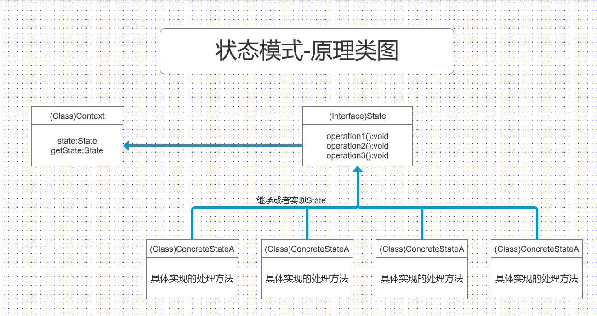
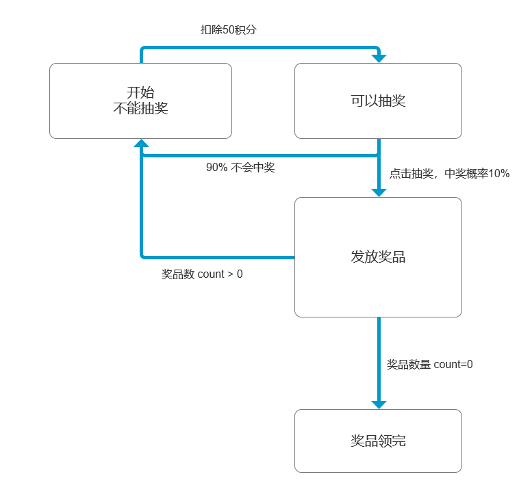

## 状态模式 

* **编写程序时需要编写大量的 if-else 判断，因此像有没有代替if-else 的方法或方式，从而学习的状态模式**
### 根据不同的状态生成不同的类，不同状态类里面存在相同的方法，只是对方法进行不同的处理
#### 基本介绍
* 状态模式（State Pattern）： 它主要用来解决对象在多种状态转换时，需要对外输出不同的行为的问题。状态和行为是一一对应的，状态之间可以相互转换
* 当一个对象的内在状态改变时，允许改变其行为，这个对象看起来像是改变了基类
  
#### 状态模式的原理类图

#### 对原理类图的说明---即（状态模式的角色及职责）
* Context 类为环境角色，用于维护ConcreteState实例，这个实例定义当前状态
* State 是抽象状态角色，定义一个接口封装与Context的一个特点接口相关行为 
* ConcreteState 具体的状态角色，每个子类实现一个与Context的一个状态相关行为

#### APP抽奖活动问题
* 请编写程序完成APP抽奖活动  具体要求如下
  * 1. 假如每参加一次活动要扣除用户50积分，中将概率是10%
  * 2. 奖品数量固定，抽完就不能抽奖
  * 3. 活动有四个状态：可以抽奖、不能抽奖、发放奖品和奖品领完
  * 4. 活动的四个状态转换关系图

#### APP 抽奖流程（此为一个简单的单线程程序）
* 1. 首先创建一个抽象的接口或者类  State，里面有几个抽象方法，即具体的操作，如扣除积分、是否抽中奖品、发放奖品  这三个行为
* 2. 上面三个行为对应四个状态：创建四个状态类，CanRaffleState（可以抽奖）、DispenseOutState（发奖完毕状态）、DispenseState（发放奖品状态）、NoRaffleState（不能抽奖状态） 这四个类都实现或继承 State
* 3. 创建Context 环境角色：RaffleActivity（对外提供的类，通过这个类对具体的四个状态类进行调用）、与相关的整体上的逻辑操作
* 4. 左后创建一个执行、测试类 ClientTest ，进行操作

#### 状态模式-APP抽奖 具体相关的代码
* [State,抽象或接口类](\file\状态模式相关说明代码\state\State.java)
* [CanRaffleState（可以抽奖）](\file\状态模式相关说明代码\state\CanRaffleState.java)
* [DispenseOutState（发奖完毕状态）](\file\状态模式相关说明代码\state\DispenseOutState.java)
* [DispenseState（发放奖品状态）](\file\状态模式相关说明代码\state\DispenseState.java)
* [NoRaffleState（不能抽奖状态）](\file\状态模式相关说明代码\state\NoRaffleState.java)
* [RaffleActivity（对外提供的类，通过这个类对具体的四个状态类进行调用）](\file\状态模式相关说明代码\state\RaffleActivity.java)

#### 状态模式在实际项目-借贷平台源码剖析
* 状态模式在实际项目-借贷平台  源码剖析

* 首先创建一个State 状态的接口
* 再创建一个实现这个接口的抽象类 AbstractState 默认实现了 State 接口的所有方法 该类的所有方法，其子类(具体的状态类)，可以有选择的进行重写（只重写自己需要的方法）
* 创建状态 实现类：FeedBackState、GenerateState、NotPayState、PaidState、PublishState、ReviewState
* 创建一个枚举类：StateEnum 存放的是各个状态的名称
* 创建Context类，包含各state 状态，各业务间的调用逻辑在此处进行；根据我们的业务流程处理，不停的变换状态
* 创建一个测试类，通过调用Context 处理相关流程

#### 状态模式的注意事项和细节
* **状态模式的注意事项和细节**
* 1. 代码有很强的可读性。状态模式将每个状态的行为封装到对应的一个类中
* 2. 方便维护。将容易产生问题的if-else语句删除了，如果把每个状态的行为都放到一个类中，每次调用方法时都要判断当前是什么状态，不但会产生出很多if-else语句，而且容易出错
* 3. 符合“开闭原则” 。容易增删改查
* 4. 会产生很多类。每个状态都要对应一个类，当状态过多时会产生很多类，加大维护难度
* 5. 当一个事件或者对象有很多种状态，状态之间会相互转换，对不同状态要求有不同行为的时候，可以考虑使用状态模式