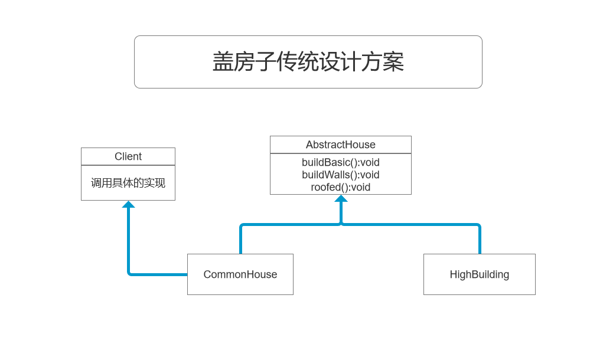
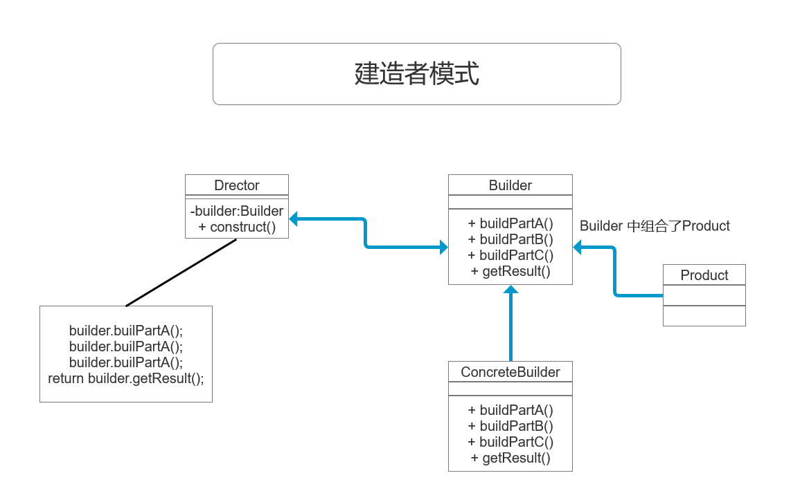
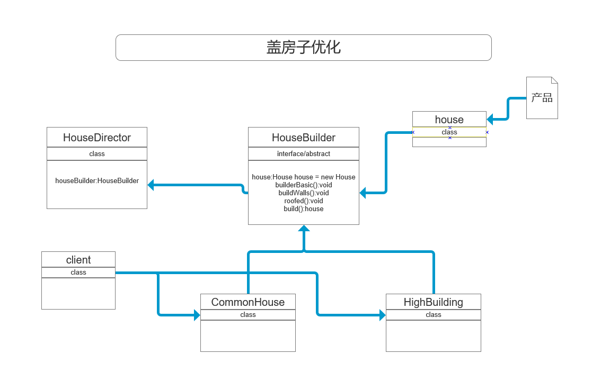

## 设计模式--建造者模式

#### 建造者模式，个人认为是通过各个部件（方法）最终生成一个产品（即返回一个类的时候），使用该模式
#### 盖房项目需求
* 1. 需要建造房子：这一过程为打桩、砌墙、封顶
* 2. 房子有各种各样的，比如普通房、高楼、别墅，各种房子的过程虽然一样，但是要求不要相同的
* 3. 编写程序，完成需求

#### 设计类图

#### 代码实现在 study-demo 的package com.example.demo.builder;  包中

#### 传统方式解决盖房的 问题分析
* 优点是比较好理解，简单易操作
* 设计的程序结构，过于简单，没有设计缓存层对象，程序的扩展或维护不好，也就是说，这种设计方案，把产品（即：房子）和创建产品的过程（即建造房子流程）封装在一起，耦合性增强了
* 解决方案：将产品和产品建造过程解耦 => 建造者模式

#### 建造者模式基本介绍
* **基本介绍**
* 1. **建造者模式（builder Pattern）** 又叫生成器模式，是一种对象构建模式。它可以将复杂对象的建造过程抽象出来（抽象类别），使这个抽象过程的不同实现方法可以构造出不同表现（属性）的对象
* 2. **建造者模式**是一步一步创建一个复杂的对象，它允许用户只通过指定复杂对象的类型和内容就可以构建他们，用户不需要知道内部的具体构建细节

#### 建造者模式-原理类图

#### 建造者模式的四个角色
* **Product(产品角色)**：一个具体的产品对象（这个地方是对产品的描述，是个空的未建造的类）
* **Builder(抽象的建造者)**： 创建一个Product对象的各个部件指定的 接口/抽象类 （**这个是抽象的建造者，具体的处理在子类实现**）
* **ConcreteBuilder(具体建造者)**：实现接口，构建和装配各个部件（**在这个地方创建Product 中的各个部件，是Product的子类，通俗来讲时创建各个部件的业务逻辑**）
* **Director(指挥者)**：构建一个使用Builder接口的对象。它主要是用于创建一个复杂的对象。它主要有两个作用，一是：隔离了客户与对象的生产过程，二是：负责控制产品对象的生产过程**通俗来讲，就是构建产品时具体各个部件该按什么顺序来处理的步骤，即此处为创建产品的业务逻辑**

#### 盖房问题 优化解决方案 类图

#### 具体代码请看 package com.example.demo.builder.improve; 包中的代码

#### 建造者模式在JDK的应用和源码分析
* 1. java.long.StringBuilder 中的建造者模式
* 2. 代码说明+Debug
* 3. 源码中建造者模式的分析
  * Appendable 接口定义了多个append方法(抽象方法)，即Appendable 为抽象建造者
  * AbstractStringBuilder 实现了Appendable 接口方法。这里的AbstractStringBuilder 已经是建造者，只是不能实例化
  * StringBuilder 即充当了指挥者这个角色，同时充当了具体的建造者，建造方法的实现是由 AbstractStringBuilder 完成，二StringBuilder 继承了 AbstractStringBuilder

#### 建造者模式的注意事项和细节
* **抽象工厂模式 VS 建造者模式**
  * 抽象工厂模式实现对产品家族的创建，一个产品家族时这样的一系列产品：具有不同分类维度的产品组合，采用抽象工厂模式不需要关心构建过程，只关心什么产品由什么工厂生产即可。而建造者模式则是要求按照指定的蓝图建造产品，他的主要目的时通过组装零配件而产生一个新产品
* 建造者模式所创建的产品一般具有较多的共同点，其组成部分相，**如果产品之间的差异性很大，则不适合使用建造者模式**，因此使用范围受到一定限制
* 