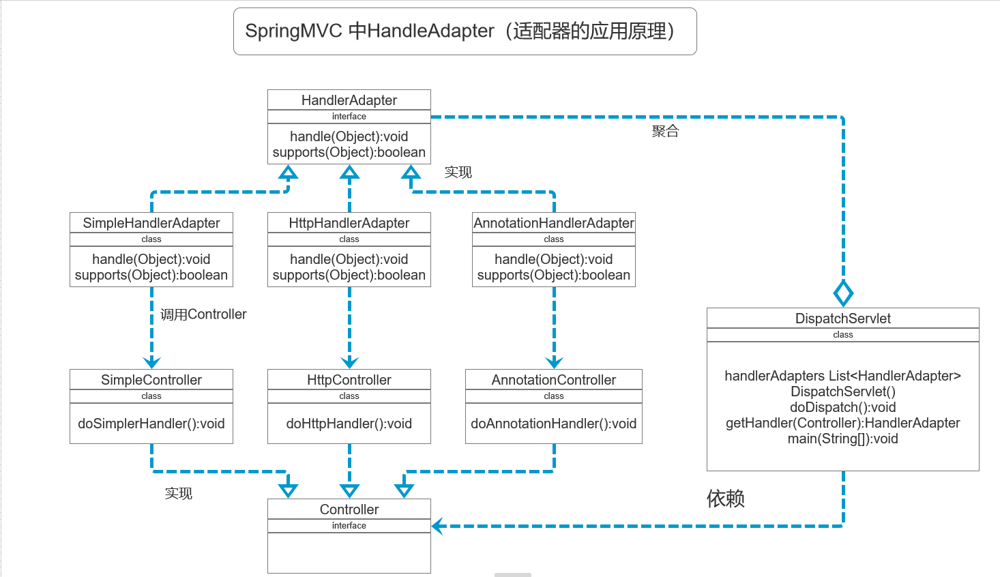

## 设计模式--适配器模式
### 个人感觉比较混乱，就是将不能直接使用的接口或者类，通过适配者进行转换，使其可以使用；
### 有个疑问：在SpringMVC中的适配器模式，不是为了解决两个接口或者类不能直接使用的目的
### 而是：Spring定义了一个适配接口，使得每一种Controller有一种对应的适配器实现类， 让适配器代替controller执行相应的方法。这样在扩展Controller 时，只需要增加一个适配器类就完成了SpringMVC的扩展了

#### 泰国旅游使用插座问题
* 现实生活中的适配器的例子
* 泰国插座用的是两孔的（欧标），可以买几个多功能转换插头（适配器），这样可以使用了
  
#### 适配器模式基本介绍
* 1. **适配器模式（Adapter Pattern）**将某个类的接口转换成客户端期望的另一个接口另一个接口表示，主要目的是兼容性，让原本因接口不匹配不，能一起工作的两个类可以协同工作。其别名为包装器（Wrapper）
* 2. 适配器模式属于结构型模式（没有产生新的类，只是进行了结构调整）
* 3. 主要分为三类：类适配器模式、对象适配器模式、接口适配器模式

#### 适配器模式的工作原理
* 1. 适配器模式：将一个类的接口转换成另一种接口，让原本接口不兼容的类可以兼容
* 2. 从用户的角度看不到被适配者，是解耦的
* 3. 用户调用适配器转化出来的目标接口方法，适配器再调用被适配者的相关接口方法
* 4. 用户收到反馈结果，感觉只是和目标接口交互

#### 1. 类适配器
* **类适配器模式介绍**
  * 基本介绍：Adapter类，通过继承src类，实现dst类接口，完成src->dst的适配
* **类适配器模式应用实例**
  * 1. 应用实例说明
        以生活中充电器的例子来讲解适配器，充电本身相当于Adapter，220V交流电相当于src（即被适配者），我们的dst（即 目标）是5V直流电
  * 2. 思路分析图
    * 
  * 3. 方式代码请看 package com.example.demo.adapter.classadapter;
  * **类适配器模式注意事项和细节**
    * 1. java 是单继承机制，所以类适配器需要继承src类这一点算是一个缺点，因为这要求dst必须是接口，有一定局限性
    * 2. src类的方法再Adapter中都会暴露出来，也增加了使用的成本
    * 3. 由于其继承了src类，所以它可以根据需求重写src类的方法，使得Adapter的灵活性增强了

#### 2. 对象适配器
  
**对象适配器模式介绍**
* 1. 基本思路和类适配器模式相同，只是将Adatper类作修改，不是继承src类，而是持有src类的实例，以解决兼容性的问题。即：持有src类，实现src类接口，完成src->dst的适配
* 2. 根据"合成复用原则"，在系统中尽量使用关联关系来代替继承关系
* 3. **对象适配器模式是适配器模式常用的一种**
  
**对象适配器模式应用实例**
* 核心思想： 主要去修改适配器类，将原来的继承，改成持有 原来继承类的实例
  
**对象适配器模式注意事项和细节**
* 对象适配器模式和类适配器模式其实算是同一种思想，只不过实现方式不同。根据合成复用原则，使用组合代替继承，所以它解决了类适配器必须继承src的局限性问题，也不再要求dst必须是接口
* 使用成本低，更灵活

#### 3. 接口适配器模式
**接口适配器模式介绍**
* 1. 一些书籍称为：适配器模式（Default Adapter Pattern）或缺省适配器模式
* 2. **当不需要全部实现接口提供的方法时，可以先设计一个抽象类实现接口，并为该接口中每个方法提供一个默认实现（空方法），那么该抽象类的子类可有选择地覆盖父类的某些方法来实现需求**
* 3. 适用于一个子接口不想使用其所有的方法的情况

**接口适配器模式应用实例**
* 1. Android 中的属性动画ValueAnimator类可以通过addListener listener 方法添加监听器

**demo代码 见 package com.example.demo.adapter.interfaceadapter;**

#### ★适配器模式在SpringMVC框架应用的源码分析 ★ 这是一个面试题
* **在SpringMVC中的HandlerAdapter，使用了适配器模式**
* 可以根据 https://www.cnblogs.com/tongkey/p/7919401.html 进行理解

**动手写SpringMVC通过适配器模式 获取到对应的Controller的源码**
* **应用原理类图如下**
* 
* **先把所有的适配器放在容器里面，方便后面比较是哪一种适配器**
* **1、在doDispatch里面先更具请求拿到Controller（handler）**
* **2、再根据Controller（Handler）获取对应的HandlerAdapter**
* **3、然后根据HandlerAdapter去调用控制器（Controller/Handler）中的方法**
* **4、HandlerAdapter中会调用Controller（Handler）中的方法**

* **说明**
* Spring定义了一个适配器接口，使得每一种Controller有一种对应的适配器实现类
* 适配器代替controller执行相应的方法
* 扩展Controller时，只需要增加一个适配器类就完成了SpringMVC的扩展了

#### 适配器模式的注意事项和细节
* 1. 三种命名方式，是根据src是以怎样的形式给到Adapter（在Adapter里的形式）来命名的
* 2. 类适配器：以类给到，在Adapter里，就是将src当作类，继承
  对象适配器：以对象给到，在Adapter里，将src作为一个对象，持有
  接口适配器：以接口给到，在Adapter里，将src作为一个接口，实现
* 3. Adapter模式最大的作用还是将原本不兼容的接口融合在一起工作
* 4. 实际开发中，实现起来不拘泥于我们讲解的三种经典形式