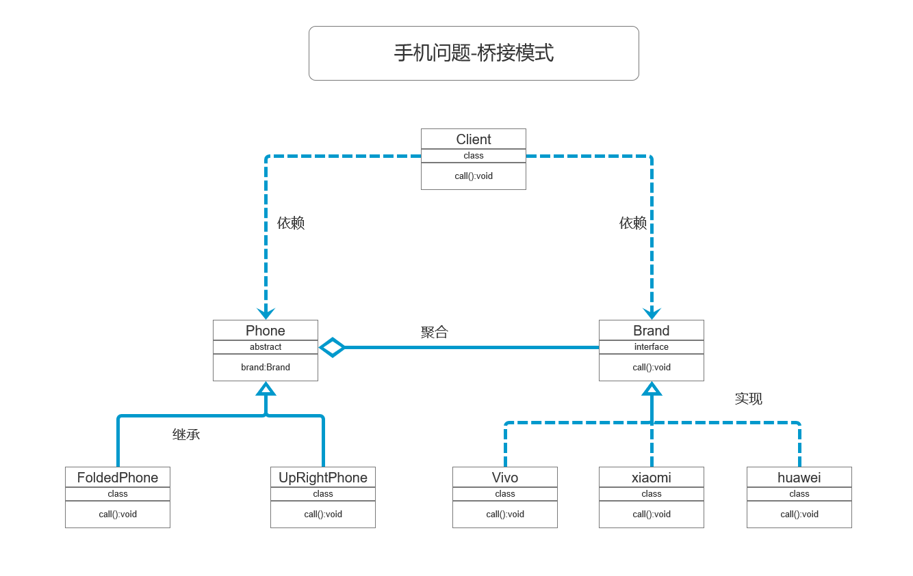
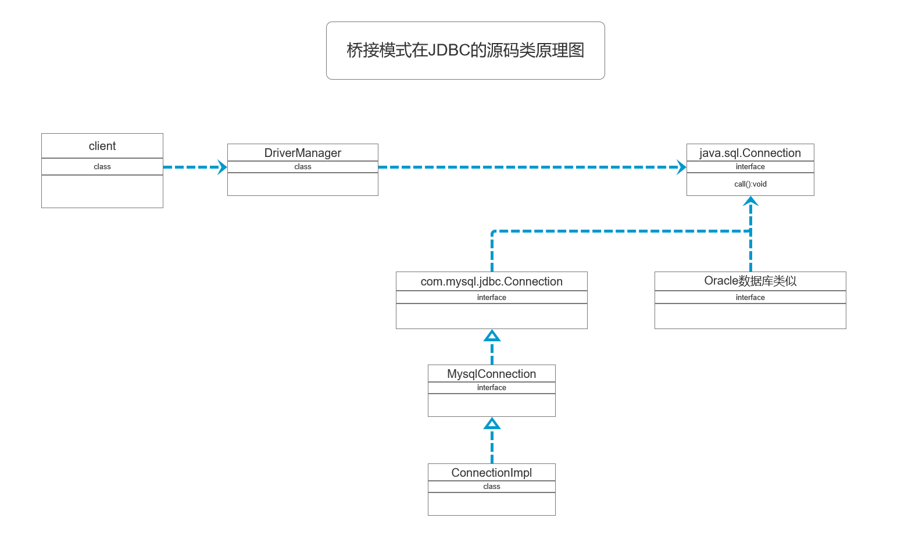

## 设计模式--桥接模式
#### 个人认为：抽象化与实现化的脱耦；
#### 桥接模式替代多层继承方案，可以减少子类的个数，降低系统的管理和维护成本
#### 手机操作问题
* 现在对不同手机类型的不同品牌实现操作编程（比如：开机、关机、上网、打电话等）

#### 传统方案解决手机操作问题
* **类原理图如下**
  
* **传统方案解决手机操作问题分析**
  * 1. 扩展性问题（类爆炸），如果我们再增加手机的样式（旋转式），就需要增加各个品牌手机的类，同样如果我们增加一个手机品牌，也要在各个手机样式类下增加；
  * 2. 违反了单一职责原则，当我们增加手机样式时，要同时增加所有品牌的手机，这样增加了代码维护成本
  * 3. 解决方案--使用桥接模式

#### 桥接模式(Bridge)--基本介绍
* **基本介绍**
* 1. 桥接模式（Bridge）是指：将实现与抽象放在两个不同的类层次中，使两个层次可以独立改变
* 2. 是一种结构型设计模式
* 3. Bridge模式基于类的最小设计原则(增加功能尽量少增加类)，通过使用封装、聚合及继承等行为让不同的类承担不同的职责。它的主要特点是吧抽象(Abstraction)与行为实现(implementation)分离开来，从而可以保持各部分的独立性以及应对他们的功能扩展

* **桥接模式-原理类图**
* 
* **原理类图说明**
* 1. Client类：桥接模式的调用者
* 2. 抽象类(Abstraction):维护了 Implementor/即它的实现类ConcreteImplementorA...,二者是聚合关系，Abstraction 充当桥接类（这个抽象类将实现与接口连接起来了）
* 3. RefinedAbstraction：是Abstraction抽象类的子类
* 4. Implementor：行为实现类的接口
* 5. ConcreteImplementorA/B:行为的具体实现类
* 6. 从UML图：这里的抽象类和接口是聚合关系，其实是调用和被调用关系

#### 桥接模式-解决手机问题
**类原理图**

**代码实现**
* 见代码 package com.example.demo.bridge; 包中的类

#### 桥接模式在JDBC的源码剖析
* 1. Jdbc 的 Driver接口，如果从桥接模式来看，Driver就是一个接口，下面可以有Mysql的Driver，Oracle的Driver，这些就可以当作实现接口的类
* 2. 代码+Debug 分析
* **原理类图**
* 

#### 桥接模式的注意事项和细节
* 1. 实现了抽象类和实现部分的分离，从而极大地提供了系统的灵活性，让抽象部分和实现部分独立开来，这有助于系统进行分层设计，从而产生更好的结构化系统
* 2. 对于系统的高层部分，只需要知道抽象部分和实现部分的接口就可以了，其它的部分由具体业务来完成
* 3. **桥接模式替代多层继承方案，可以减少子类的个数，降低系统的管理和维护成本**
* 4. 桥接模式的引入增加了系统的理解和设计难度，由于聚合关联关系建立在抽象层，要求开发者针对抽象进行设计和编程
* 5. 桥接模式要求正确识别出系统中两个独立变化的维度，因此其使用范围有一定的局限性，即需要由这样的应用场景

#### 桥接模式其它应用场景
* 1. 对于那些不希望使用继承或因为多层次继承导致系统类的个数急剧增加的系统，桥接模式尤为使用
* 2. 常见的应用场景
  * JDBC驱动连接
  * 银行转账系统
    * 转账分类：网上转账，柜台转账，ATM机转账
    * 转账用户类型：普通用户、银卡用户、金卡用户、。。。
  * 消息管理
    * 消息类型：即时消息、延时消息
    * 消息分类：手机短信、邮件消息、QQ消息、。。。