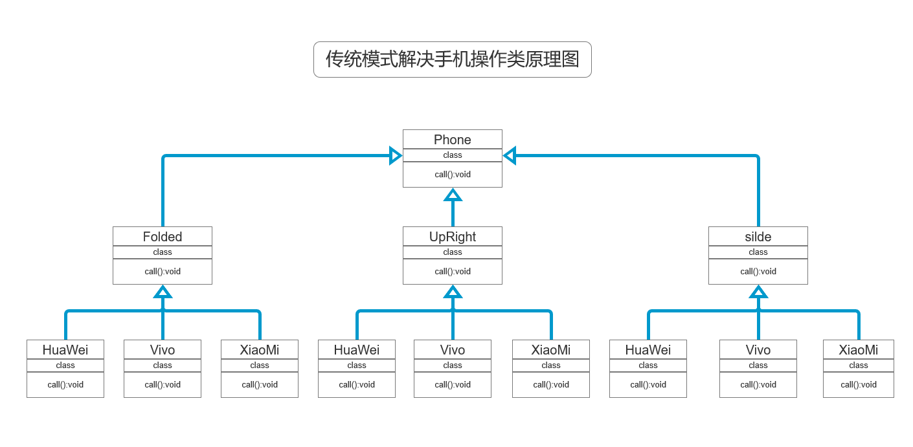
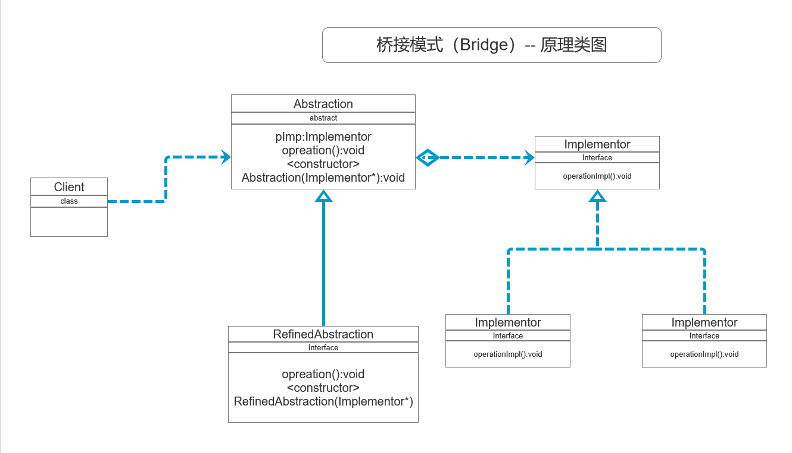

## 设计模式--桥接模式
#### 手机操作问题
* 现在对不同手机类型的不同品牌实现操作编程（比如：开机、关机、上网、打电话等）

#### 传统方案解决手机操作问题
* **类原理图如下**
  
* **传统方案解决手机操作问题分析**
  * 1. 扩展性问题（类爆炸），如果我们再增加手机的样式（旋转式），就需要增加各个品牌手机的类，同样如果我们增加一个手机品牌，也要在各个手机样式类下增加；
  * 2. 违反了单一职责原则，当我们增加手机样式时，要同时增加所有品牌的手机，这样增加了代码维护成本
  * 3. 解决方案--使用桥接模式

#### 桥接模式(Bridge)--基本介绍
* **基本介绍**
* 1. 桥接模式（Bridge）是指：将实现与抽象放在两个不同的类层次中，使两个层次可以独立改变
* 2. 是一种结构型设计模式
* 3. Bridge模式基于类的最小设计原则(增加功能尽量少增加类)，通过使用封装、聚合及继承等行为让不同的类承担不同的职责。它的主要特点是吧抽象(Abstraction)与行为实现(implementation)分离开来，从而可以保持各部分的独立性以及应对他们的功能扩展

* **桥接模式-原理类图**
* 
* **原理类图说明**
* 1. Client类：桥接模式的调用者
* 2. 抽象类(Abstraction):维护了 Implementor/即它的实现类ConcreteImplementorA...,二者是聚合关系，Abstraction 充当桥接类（这个抽象类将实现与接口连接起来了）
* 3. RefinedAbstraction：是Abstraction抽象类的子类
* 4. Implementor：行为实现类的接口
* 5. ConcreteImplementorA/B:行为的具体实现类
* 6. 从UML图：这里的抽象类和接口是聚合关系，其实是调用和被调用关系

